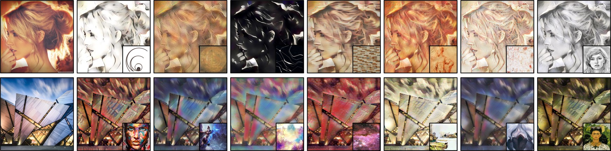
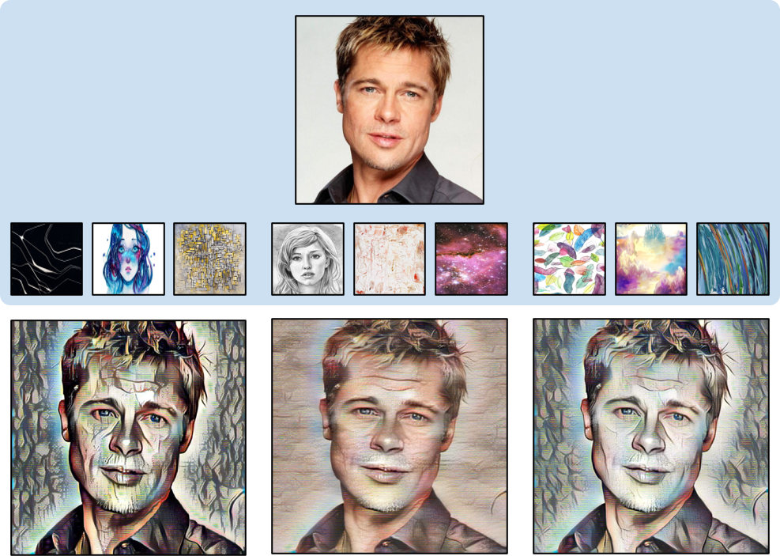

# Style-Transfer-with-Target-Feature-Palette-and-Attention-Coloring

## Example Results
### Diverse stylized results
</img>

Single style transfer with two content images with seven different style images.

### Multi-style transfer results
</img>

Three multi-stylized images are generated using four input images (i.e., one content image and three style images) with different settings.

## Usage
### Prerequisites
- Python 3.7
- Pytorch 0.4.1
- TorchVision 0.2.1
- Pillow
- Visdom
- Cupy

### Getting Started
#### Installation
Clone this repo:
```bash
git clone https://github.com/SuhyeonHa/Style-Transfer-with-Target-Feature-Palette-and-Attention-Coloring
cd Style-Transfer-with-Target-Feature-Palette-and-Attention-Coloring
```
#### Dataset
- [MS-COCO(train2014)](http://images.cocodataset.org/zips/train2014.zip) for content dataset
- [Painter by Numbers](https://www.kaggle.com/c/painter-by-numbers/overview) for style dataset 

#### Model Training
#### Use a Pre-trained Model
